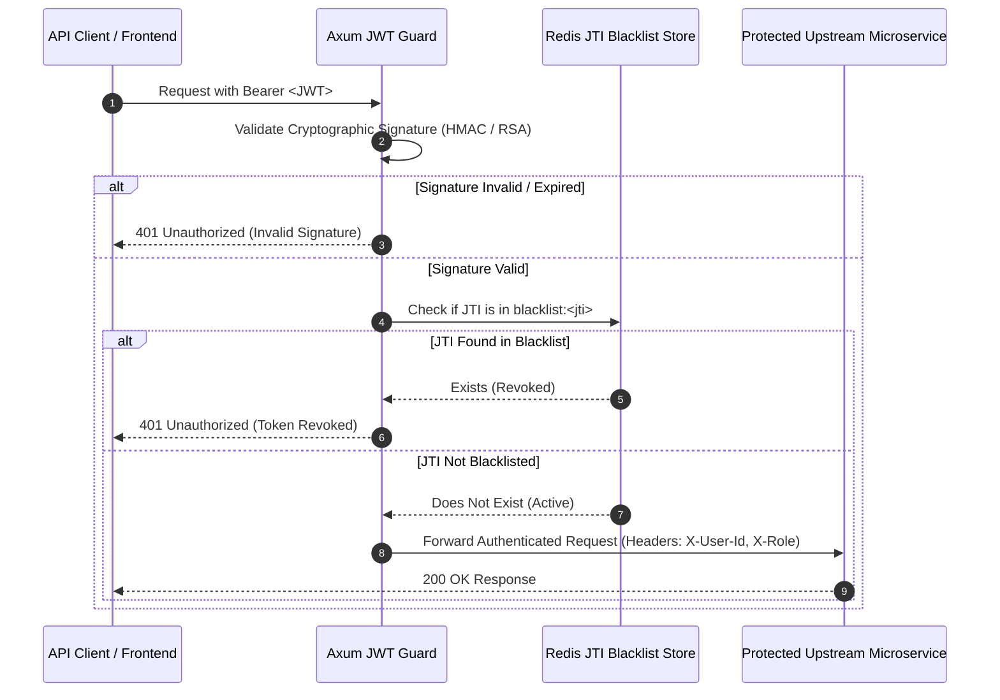

# jwt-guard-rs

[](https://github.com/txltedxgod/jwt-guard-rs/actions)
[](https://opensource.org/licenses/MIT)
[](https://www.rust-lang.org/)
[](https://redis.io/)


> High-throughput **JWT Authentication & Token Revocation Gateway** with **Redis JTI blacklisting**, Argon2 hashing, and async **Axum** microservice routing written in **Rust 2021**.

[](https://rust-lang.org)
[](https://github.com/tokio-rs/axum)
[](https://redis.io)
[](https://github.com/txltedxgod/jwt-guard-rs/actions)
[](https://docker.com)
[](LICENSE)

`#rust` `#jwt` `#redis` `#axum` `#tokio` `#authentication` `#security` `#microservices`

---

## 🏛️ Token Verification & Revocation Flow



---

## Features

- **Instant Token Revocation:** Instant JTI blacklist check via Redis with exact TTL expiration.
- **Asynchronous & Non-Blocking:** Powered by Tokio and Axum 0.7 for sub-millisecond authentication overhead.
- **Argon2id Password Security:** Memory-hard password verification algorithm preventing GPU cracking.

## Quick Start

```bash
# 1. Start Redis
docker run -d -p 6379:6379 redis:7-alpine

# 2. Run Gateway
cargo run
```